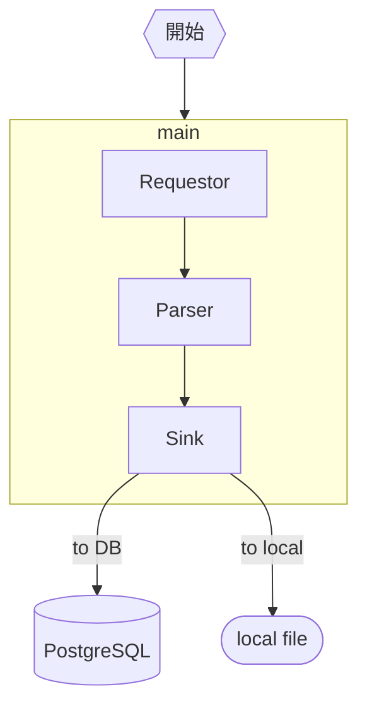

# Crawler

A simple web crawler framework developed collaboratively by EJ and Chihwei.

```mermaid

graph TD;
	A{{開始}} --> main[main]

	subgraph main
		B1[Requestor];
		B2[Parser];
		B3[Sink];
		B1 --> B2;
		B2 --> B3;
	end

B3 -->|to DB| D1[(PostgreSQL)]
B3 -->|to local| D2([local file])
```